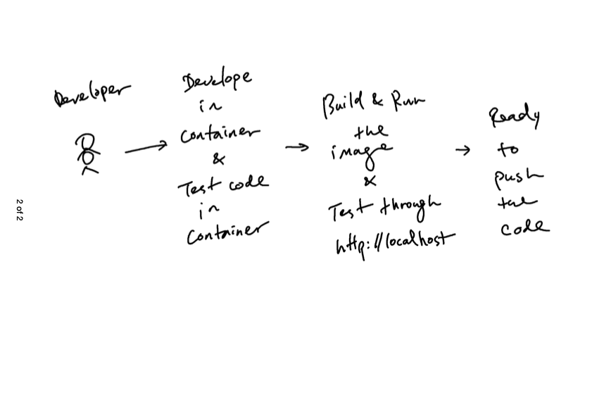
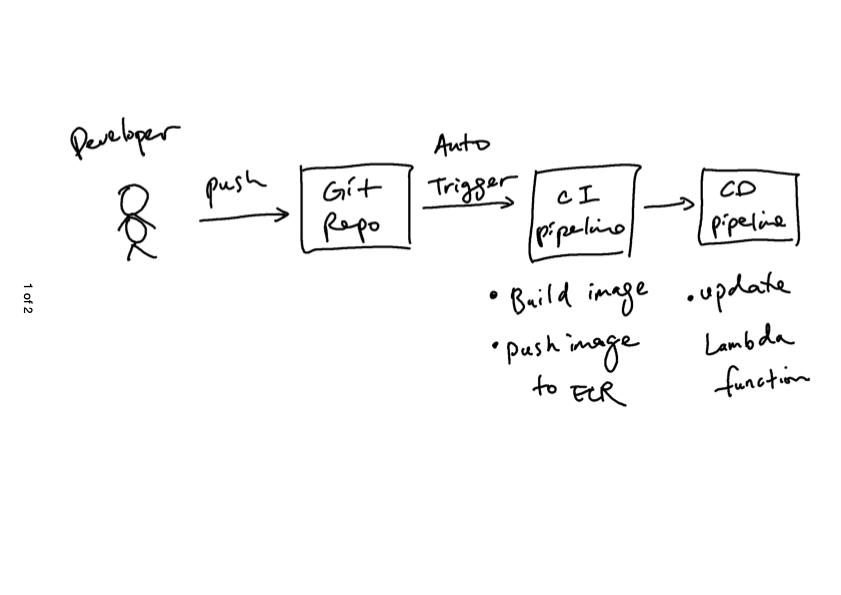

# What is this repo? 
This is a repo with initial POC code on how to deploy a AWS lambda function using docker image in AWS ECR. <br>
 <br>


# References
* https://docs.aws.amazon.com/lambda/latest/dg/python-image.html#python-alt-test


# Local Development
1. Develope inside the container which is planed to be deployed using VSCode with the following features
    1. Debugging 
    2. Unit testing
    3. Python Interactive window
2. Integration test in local
    1. Build the image with name as `aws-lambda-container_myfunction`(`<folder-name>_<service-name>`)
        ```sh
        docker-compose build
        ```
    2. Test the function 
        1. Download the runtime interface emulator (one-time)
        ```sh
        mkdir -p ~/.aws-lambda-rie && \
            curl -Lo ~/.aws-lambda-rie/aws-lambda-rie https://github.com/aws/aws-lambda-runtime-interface-emulator/releases/latest/download/aws-lambda-rie && \
            chmod +x ~/.aws-lambda-rie/aws-lambda-rie
        ```
        2. Spin up the container 
            ```sh
            docker run -d \
                -v ~/.aws-lambda-rie:/aws-lambda \
                -p 9000:8080 \
                --entrypoint /aws-lambda/aws-lambda-rie \
                aws-lambda-container_myfunction:latest \
                /venv/bin/python -m awslambdaric lambda_function.handler
            ```
        3. Invoke the function
            ```sh
            curl "http://localhost:9000/2015-03-31/functions/function/invocations" -d '{"input":"10"}'
            ```

# AWS service provision (one-time)
(since this is poc, the aws profile used here has `AdministratorAccess` in the permission policy)    
1. Authenticate the Docker CLI to your Amazon ECR registry
```sh
aws ecr get-login-password --region us-east-1 | docker login --username AWS --password-stdin 843562674612.dkr.ecr.us-east-1.amazonaws.com
```
2. Create a repository in Amazon ECR
```sh
aws ecr create-repository --repository-name my-lambda --region us-east-1 --image-scanning-configuration scanOnPush=true --image-tag-mutability MUTABLE
```
3. List repositories
```sh
aws ecr describe-repositories
```
4. Create execution role for giving the lambda function permission to access AWS resources
```sh
aws iam create-role --role-name lambda-ex --assume-role-policy-document '{"Version": "2012-10-17","Statement": [{ "Effect": "Allow", "Principal": {"Service": "lambda.amazonaws.com"}, "Action": "sts:AssumeRole"}]}'
```
5. Create the lambda function
```sh
aws lambda create-function \
--function-name my-lambda-function \
--package-type Image \
--code ImageUri=843562674612.dkr.ecr.us-east-1.amazonaws.com/my-lambda:latest \
--role arn:aws:iam::843562674612:role/lambda-ex
```
6. List lambda
```sh
aws lambda list-functions
```

# Deploy new changes manually <br>
1. Build the image
```sh
docker-compose build
```
2. Tag the image
```sh
docker tag aws-lambda-container_myfunction:latest 843562674612.dkr.ecr.us-east-1.amazonaws.com/my-lambda:latest
```
3. Push the image to ECR
```sh
docker push 843562674612.dkr.ecr.us-east-1.amazonaws.com/my-lambda:latest
```
4. Update the lambda function
```sh
aws lambda update-function-code \
--function-name  my-lambda-function \
--image-uri 843562674612.dkr.ecr.us-east-1.amazonaws.com/my-lambda:latest
```
5. Validate
```sh
aws lambda invoke \
--function-name my-lambda-function \
--payload '{"input":"10"}' response.json \
--cli-binary-format raw-in-base64-out 
```

# Main commands for CI/CD pipeline
* CI (build the image and push to ECR)
    ```sh
    # build the image
    docker-compose build
    
    # tag the image (set BuildNumber = $(Date:yyyyMMdd).$(Rev:r))
    # https://learn.microsoft.com/en-us/azure/devops/pipelines/process/run-number?view=azure-devops&tabs=yaml
    docker tag aws-lambda-container_myfunction:latest 843562674612.dkr.ecr.us-east-1.amazonaws.com/my-lambda:<BuildNumber>
    
    # push to ecr
    docker push 843562674612.dkr.ecr.us-east-1.amazonaws.com/my-lambda:<BuildNumber>
    ```
* CD (update the lambda function using the new version of image from ECR)
    ```sh
    # update the lambda function
    aws lambda update-function-code \
    --function-name  my-lambda-function \
    --image-uri 843562674612.dkr.ecr.us-east-1.amazonaws.com/my-lambda:<BuildNumber>
    ```

